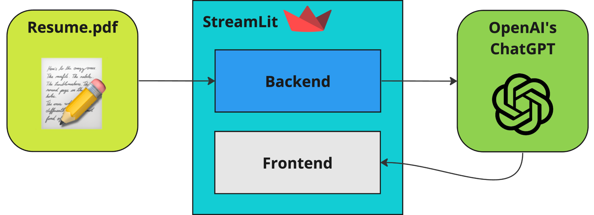

# Build A Resume Reviewer App With ChatGPT


We can easily create an app that can review the resumes
you get in your inbox, so that you are able to save time and improve your decisions.
And you don't need to spend hundreds of dollars in other available solutions!

You can copy and paste the prospect's resume on ChatGPT and ask it to review
the application for you. However, that is not very user-friendly. You need to
spend a lot of time copying, pasting, formatting, and coming up with the 
right prompt. Is there a better way to do it? Of course! 

In this article we will create an app from scratch
that will be able to review the resumes you get in your inbox
in no time!

We will be using:
- StreamLit to quickly build our app
- PyPDF2 to transform the PDF file into text that we can pass to ChatGPT
- OpenAI API with function calling to extract the target data from the resume



Before we even start the article, you can try the app here:

### [📝 Resume Reviewer App](link)

Now that you know how the app looks and feels, let's get started.


⚠️ Please note, this article assumes that either you or one of your team members have a moderate understanding of Python.

## 1. The idea

We will start by defining what the app will do:

1. Have the job description in text format. This will be used for evaluation.
2. Have the resume in PDF format. We will extract the data from it.
3. Get the resume data and the job description and pass it to ChatGPT
4. Ask ChatGPT to extract data from the resume and also evaluate the prospect based on the job description.
5. Display the result in our app

Simple strategy, but effective nonetheless.

## 2. The backend

First and foremost, let's make sure you have the right libraries for the job.
Using pip, you can install them with the command:

    pip install openai streamlit pypdf2

Now, we can define the backend of our application.
With the StreamLit library, it is pretty easy to do. With just a few
lines of code, we can add the header and the submit-form to our app.

```python
# app.py
import streamlit as st

st.set_page_config(page_title='📝 Resume Ratings')
st.title("📝 Resume Ratings")
st.markdown("Use this application to help you decide if the prospect is a good fit for the job.")

with st.form('resume_form'):
    job_description = st.text_area(label="""Write the Job Description here.
                                            Insert key aspects you want to value in the prospect's resume.""",
                                   placeholder="Job description. This field should have at least 100 characters.")
    file = st.file_uploader("Add the prospect's resume in PDF format:", type=["pdf"])
    st.form_submit_button('Submit')
```

The beautiful thing about StreamLit is that the code above is enough to
see the app live. Of course, it doesn't do anything yet, but at least
we can check how most of it will look. You can do that by running the command:

    streamlit run app.py

In the terminal it will give you the URL in which your app will be available:

    You can now view your Streamlit app in your browser.

    Local URL: http://localhost:8500
    Network URL: http://192.168.0.0:0000

Click on one of them to access and see your app live. Now, every time we
add new code, you can just refresh the page and the app will be updated 
to the newest version that matches your `app.py`.

Before we proceed, just take a note that now the job description and the pdf are
stored in the `job_description` and `file` variables, respectively.

## 3. Extract text from the PDF

In order to pass the information from the resume to the GPT model, we need to
first extract it from the file as text format. There are many libraries that can
perform this task, and the one we chose for that is [PyPDF2](https://pypi.org/project/PyPDF2/) because
it is easy to use and can get the data in binary format, so that we don't need to 
store the PDF file before we access it.

Continuing with our app, we can add the following code to it:
```python
# We start by making sure the file has been submitted and
# the job description has at least 100 characters
if file is not None and len(job_description) > 100:
    pdf_file = PdfReader(file)  # Read the file
    pdf_text = ""  # We will store the text in this variable
    # PyPDF2 reads the PDF in pages, so we go through each page
    # and store the extracted text into the pdf_text variable
    for page in pdf_file.pages:
        pdf_text += page.extract_text() + "\n"

    # We will create the extract_resume_data() method next
    # To get all the valuable information from the resume
    # using the GPT model
    resume_data = extract_resume_data(pdf_text, job_description)
```

__Before we move forward, I bet you're just like me, eager for the latest and greatest AI content. 
That's why I've put together a fantastic weekly newsletter featuring the top AI and automation news for your business.
Subscribe to the newsletter, and I promise your email will remain safe and sound — I won't 
share or sell it. So why not give it a shot? You've got nothing to lose and a lot
to gain! [Subscribe to the newsletter here](https://wolfflow-ai.beehiiv.com/subscribe).__


## 4. Extract resume data using ChatGPT

Now that you subscribed to the newsletter we can proceed! 😄 Let's first define what do we want ChatGPT to provide based
on the resume and the job description. This is where each
implementation will differ, so feel free to pick the ones
work best for your own use case.

In our app, we are using:
1. Name
2. Years of Experience
3. Summary of the application

And the following are values between 1 and 10 of how much each fits the job description. In other words, we are asking 
the GPT model: 
"rate the following, giving scores between 1 and 10, of how much do you think this prospect fits the job description".

4. Education 
5. Company fit
6. Technical skills
7. Soft skill 
8. Projects  

With this list in mind, we can ask the GPT model to extract each one of them so that
we can display to the final user. Cool!

Then, our next steps are:
1. Come up with a prompt that will get the results we want
2. Send the prompt to the GPT model
3. Get the answer from the model and extract each point mentioned above
4. Display to the user

Amazing! Now we can move forward.

### Defining our prompt
We can utilize the following prompt to suggest the GPT model to provide the information we want.
```python
prompt = f"""You are a professional HR recruiter and your job is to give ratings to a prospect based on the
             job description. Do not output anything else.
             The job description is as follows: {job_description}
             
             The prospect's resume is as follows: {data}
             """
```

However, with this prompt there is no instruction to retrieve the review and the scores we want from the resume.

We will do that by using Function Calling, which is a way to extract structured data from texts. If you want to learn more about it, you can [read the official documentation](https://platform.openai.com/docs/guides/gpt/function-calling).

### Extract the structured data with function calling

We need to lay out everything in the function calling object so that
GPT knows exactly what to extract. This piece of code shows how to extract 3 of the 8 points we mentioned earlier. You can
find the complete list in Github.

```python
function_descriptions = [
        {
            "name": "extract_resume_ratings",
            "description": "Extract information ratings from resume.",
            "parameters": {
                "type": "object",
                "properties": {
                    "name": {
                        "type": "string",
                        "description": "Extract prospect name",
                    },
                    "years_of_experience": {
                        "type": "number",
                        "description": "Extract prospect total years of experience",
                    },
                    "company_fit": {
                        "type": "number",
                        "description": "Evaluate in a scale from 1 to 10 how much the prospect is a fit for the position: [1, 2, ..., 9, 10] 1 being not fit at all and 10 being a perfect fit",
                },
                "required": ["name", "years_of_experience", "company_fit"]
            }
        }
    ]
```

After this, we can add the prompt to a message and invoke the GPT method to request the model
to predict the output we desire:

```python
messages = [{"role": "user", "content": prompt}]

response = openai.ChatCompletion.create(
    model="gpt-3.5-turbo-0613",
    messages=messages,
    functions=function_descriptions,
    function_call="auto"
)
```

The response will have lots of unnecessary data included in it. Let's get only the data we need for our application.

```python
def extract_resume_data(data: str, job_descr: str) -> dict | None:
    # get_gpt_response is the method that will return the response we saw above
    gpt_response = get_gpt_response(data, job_descr) 
    response_message = gpt_response["choices"][0]["message"]
    reviews = response_message.get("function_call")
    result = reviews.get("arguments")

```
The problem is that the result can be either a string or a dictionary.
We want to make sure we are returning a dictionary from it, so we convert the string to dictionary if necessary with
the following piece of code:


```python
    if reviews and isinstance(result, dict):
        return result

    if reviews and isinstance(result, str):
        import json
        try:
            json_result = json.loads(result)
            return json_result
        except json.JSONDecodeError as e:
            print("Error: Cannot be convert to a JSON object.")
            print(e)
    return None
```

With this we are ready to display the ratings from the GPT model in our app!

## 5. Display the reviewed resume in our app

Now it is time to finally display the result in our app. We can do that by getting
the values in the result dictionary and distributing them into different `st` widgets, like `.text, .slider, .markdown`,
as you can see below:
```python
if file is not None and len(job_description) > 100:
    pdf_file = PdfReader(file)
    pdf_text = ""
    for page in pdf_file.pages:
        pdf_text += page.extract_text() + "\n"

    resume_data = extract_resume_data(pdf_text, job_description)
    if resume_data:
        education = int(resume_data.get("education", 0))
        st.title("Prospect Review Based On Job Description")
        st.markdown(f"### Name: {resume_data.get('name')}")
        st.markdown(f"#### Relevant skills:\n{resume_data.get('relevant_skills')}")
        st.markdown(f"#### Summary:\n{resume_data.get('summary')}")
        st.slider(
            label="Years of experience",
            min_value=1,
            max_value=15,
            value=int(resume_data.get('years_of_experience')),
            disabled=True)
        st.slider(
            label="Education",
            min_value=1,
            max_value=10,
            value=education,
            disabled=True
        )
```
Again, to keep the article shorter we have omitted the rest of the code. Please check the code on Github.

Before the code is able to work, we need to add the `openai_api_key` to our environment variable list.
We can do that by creating a `.env` file and inserting the key as
    
    # .env
    OPENAI_API_KEY=Ins3rtY0urK3yH3re

Then in our python code we can import it by using `dotenv.load_dotenv()`:
```python
from pathlib import Path
from dotenv import load_dotenv

env_path = Path('.') / '.env'
load_dotenv(dotenv_path=env_path)
```

Then, we have everything ready to test our application!
Just update the page you opened before in your browser, 
or, ff you haven't already, run the following command
in your terminal:

    streamlit run app.py

## 6. Conclusion

🎉 Congratulations on coming to the end of one more in depth AI article! Today we saw how to:
1. Easily build an app with StreamLit
2. Transform a PDF into text
3. Create a prompt to ask GPT to rate a resume based on a job description
4. Use function calling to create structured data from prompts
5. Put everything mentioned above to create a resume rating app that saves you hours of your team's time!

If you think this was a valuable article, please consider the following:
- Subscribe to the [newsletter](https://wolfflow-ai.beehiiv.com/subscribe)
- Learn to store the resume points we extracted today into Google Sheets by [reading this other article](https://medium.com/@paulo_marcos/maximize-your-business-kpis-with-chatgpts-automated-metrics-c2406a8a0bd6) we posted
- Follow me in Medium for more in-depth articles just like this

Have a wonderful evening! See you in the next article.
